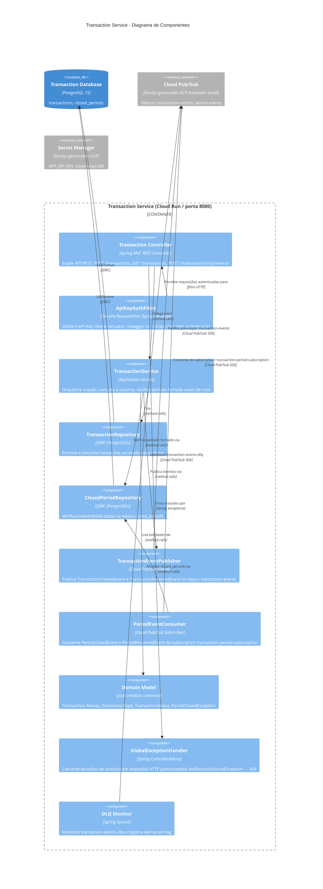
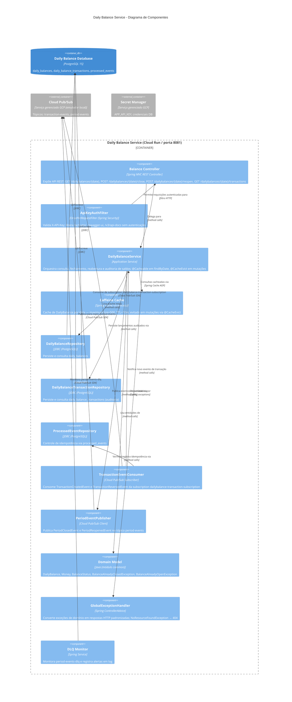

# Diagrama de Componentes (C4 - Nível 3)

## Visão Geral dos Componentes

O diagrama de componentes detalha a estrutura interna dos dois microsserviços, mostrando como são compostos internamente seguindo a **Arquitetura Hexagonal** (Ports & Adapters). A autenticação é realizada por API Key via header `X-API-Key` — sem frontend ou API Gateway nesta versão.

---

## Transaction Service - Diagrama de Componentes



### Componentes do Transaction Service

**Transaction Controller**
- Endpoints: `POST /api/transactions`, `GET /api/transactions`, `GET /api/transactions/{id}`, `POST /api/transactions/{id}/reverse`
- Converte DTOs de entrada para chamadas ao application service; retorna respostas formatadas com status HTTP apropriados.

**ApiKeyAuthFilter**
- `OncePerRequestFilter` — intercepta toda requisição antes de chegar ao controller.
- Extrai `X-API-Key` do header e compara com o valor configurado em `app.security.api-key`.
- `shouldNotFilter()` usa `contains()` para liberar URIs que contenham `/actuator`, `/swagger-ui` ou `/v3/api-docs` (necessário pelo context-path `/transaction-service` estar presente no URI completo).
- Retorna `HTTP 401` para chaves ausentes ou inválidas.

**TransactionService (Application Service)**
- Verifica `ClosedPeriodRepository.existsByDate()` antes de criar lançamento — lança `PeriodClosedException` (HTTP 422) se fechado.
- Cria estornos invertendo o tipo (`CREDIT`↔`DEBIT`) e negando o valor.
- Publica evento após persistência bem-sucedida.

**TransactionRepository / ClosedPeriodRepository**
- JDBC puro (sem JPA/Hibernate) — `JdbcTemplate` + `RowMapper`.
- Implementações concretas em `infrastructure/persistence/`.

**TransactionEventPublisher**
- Serializa eventos em JSON e publica no tópico `transaction-events`.
- Configurado via `spring-cloud-gcp-starter-pubsub` (emulador local ou Cloud Pub/Sub em produção).

**PeriodEventConsumer**
- Subscription: `transaction-period-subscription` (tópico `period-events`).
- `PeriodClosedEvent` → `ClosedPeriodRepository.save(date)`.
- `PeriodReopenedEvent` → `ClosedPeriodRepository.deleteByDate(date)`.

**DLQ Monitor**
- Monitora `transaction-events-dlq` e registra mensagens não processadas em log de alerta.

---

## Daily Balance Service - Diagrama de Componentes



### Componentes do Daily Balance Service

**Balance Controller**
- Endpoints: `GET /api/dailybalances/{date}`, `GET /api/dailybalances`, `POST /api/dailybalances/{date}/close`, `POST /api/dailybalances/{date}/reopen`, `POST /api/dailybalances/{date}/recalculate`, `GET /api/dailybalances/{date}/transactions`

**ApiKeyAuthFilter**
- Idêntico ao Transaction Service. Usa `contains()` no `shouldNotFilter()` pelo mesmo motivo (context-path `/dailybalance-service` no URI).

**DailyBalanceService (Application Service)**
- Fecha período: persiste `CLOSED` + publica `PeriodClosedEvent`.
- Reabre período: persiste `OPEN` + publica `PeriodReopenedEvent`.
- Lança `BalanceAlreadyClosedException` (HTTP 409) se tentar fechar já fechado; `BalanceAlreadyOpenException` se tentar reabrir já aberto.
- `findByDate` anotado com `@Cacheable("dailyBalances")` — resultado servido do Caffeine em cache hits.
- `closeBalance`, `reopenBalance`, `applyTransaction`, `recalculate` anotados com `@CacheEvict("dailyBalances")` — garantem consistência após mutações.

**TransactionEventConsumer**
- Subscription: `dailybalance-transaction-subscription` (tópico `transaction-events`).
- Para cada evento: verifica `processed_events`, aplica `addCredit()`/`addDebit()`, persiste auditoria em `daily_balance_transactions`, registra `eventId` em `processed_events`.

**DLQ Monitor**
- Monitora `period-events-dlq` e registra mensagens não processadas em log de alerta.

---

## Arquitetura Hexagonal — Mapeamento de Camadas

| Camada | Transaction Service | Daily Balance Service |
|---|---|---|
| **Adaptadores Primários** | `TransactionController`, `PeriodEventConsumer` | `BalanceController`, `TransactionEventConsumer` |
| **Aplicação** | `TransactionService` | `DailyBalanceService` |
| **Portas (interfaces)** | `TransactionRepository`, `ClosedPeriodRepository`, `TransactionEventPublisher` | `DailyBalanceRepository`, `ProcessedEventRepository`, `PeriodEventPublisher` |
| **Adaptadores Secundários** | `JdbcTransactionRepository`, `JdbcClosedPeriodRepository`, `PubSubTransactionEventPublisher` | `JdbcDailyBalanceRepository`, `JdbcDailyBalanceTransactionRepository`, `JdbcProcessedEventRepository`, `PubSubPeriodEventPublisher` |
| **Cache** | — | `CacheConfig` (`@EnableCaching`), Caffeine `dailyBalances` |
| **Domínio** | `Transaction`, `Money`, `TransactionType`, `TransactionStatus` | `DailyBalance`, `Money`, `BalanceStatus` |

---

## Fluxo de Dados: Nova Transação (end-to-end)

```
1. Cliente → POST /transaction-service/api/transactions (X-API-Key)
2. ApiKeyAuthFilter → valida chave → OK
3. TransactionController → chama TransactionService.create()
4. TransactionService → ClosedPeriodRepository.existsByDate() → não fechado
5. TransactionService → TransactionRepository.save() → transaction-db (INSERT)
6. TransactionService → TransactionEventPublisher.publish(TransactionCreatedEvent)
7. Cloud Pub/Sub → entrega para dailybalance-transaction-subscription
8. TransactionEventConsumer → ProcessedEventRepository.existsByEventId() → novo
9. TransactionEventConsumer → DailyBalanceService.applyTransaction()
10. DailyBalanceService → DailyBalanceRepository.findOrCreate(date)
11. DailyBalanceService → balance.addCredit(amount) / addDebit(amount)
12. DailyBalanceService → DailyBalanceRepository.save(balance) → dailybalance-db
13. DailyBalanceService → DailyBalanceTransactionRepository.save(audit)
14. TransactionEventConsumer → ProcessedEventRepository.save(eventId)
```

## Fluxo de Dados: Fechamento de Período (end-to-end)

```
1. Cliente → POST /dailybalance-service/api/balances/2025-01-20/close (X-API-Key)
2. ApiKeyAuthFilter → valida chave → OK
3. BalanceController → chama DailyBalanceService.close(date)
4. DailyBalanceService → balance.close() → lança BalanceAlreadyClosedException se já CLOSED
5. DailyBalanceService → DailyBalanceRepository.save(balance) (status=CLOSED)
6. DailyBalanceService → PeriodEventPublisher.publish(PeriodClosedEvent{date})
7. Cloud Pub/Sub → entrega para transaction-period-subscription
8. PeriodEventConsumer → ClosedPeriodRepository.save(date) → transaction-db
9. A partir daqui: POST /transactions para 2025-01-20 retorna HTTP 422
```
