# Diagrama de Componentes (C4 - Nível 3)

## Visão Geral dos Componentes

O diagrama de componentes detalha a estrutura interna dos principais contêineres do sistema, mostrando como são compostos por componentes de software. Este nível de documentação foca nos dois microsserviços principais: Transaction Service e Daily Balance Service, agora implementados no Google Cloud Run.

---

## Transaction Service - Diagrama de Componentes

```mermaid
C4Component
    title Transaction Service - Diagrama de Componentes

    Container_Boundary(transactionService, "Transaction Service (Cloud Run)") {
        Component(transactionController, "Transaction Controller", "Spring MVC REST Controller", "Expõe API REST para operações de transações")
        
        Component(transactionService, "Transaction Service", "Spring Service", "Implementa lógica de negócio para transações")
        
        Component(transactionRepository, "Transaction Repository", "Spring JDBC", "Acesso aos dados de transações")
        
        Component(transactionValidator, "Transaction Validator", "Java Bean Validation", "Valida regras de negócio para transações")
        
        Component(eventPublisher, "Transaction Event Publisher", "Cloud Pub/Sub Client", "Publica eventos de transações")
        
        Component(domainModel, "Domain Model", "Java Classes", "Modelo de domínio com entidades e regras de negócio")
        
        Component(securityFilter, "Security Filter", "Spring Security", "Filtra requisições e valida autorização")
        
        Component(exceptionHandler, "Exception Handler", "Spring ControllerAdvice", "Tratamento centralizado de exceções")
        
        Component(cloudStorageClient, "Storage Client", "Cloud Storage Client", "Cliente para armazenamento de relatórios")
    }

    ContainerDb_Ext(transactionDb, "Cloud SQL", "PostgreSQL", "Armazena transações financeiras")
    
    Container_Ext(messageBus, "Cloud Pub/Sub", "Serviço gerenciado GCP", "Comunicação assíncrona entre serviços")
    
    Container_Ext(apiGateway, "Cloud API Gateway", "Serviço gerenciado GCP", "Roteamento e segurança")
    
    System_Ext(authSystem, "Identity Platform", "Serviço de autenticação GCP")
    
    Container_Ext(storage, "Cloud Storage", "Serviço gerenciado GCP", "Armazenamento de objetos")
    
    Container_Ext(secretManager, "Secret Manager", "Serviço gerenciado GCP", "Armazenamento de segredos")

    Rel(apiGateway, transactionController, "Envia requisições para", "HTTPS/JSON")
    
    Rel(transactionController, securityFilter, "Passa por", "Filtro de segurança")
    Rel(securityFilter, authSystem, "Valida tokens com", "HTTPS/JWT")
    
    Rel(transactionController, transactionService, "Usa", "Method calls")
    Rel(transactionController, exceptionHandler, "Erros tratados por", "Spring exceptions")
    
    Rel(transactionService, transactionValidator, "Usa", "Method calls")
    Rel(transactionService, transactionRepository, "Usa", "Method calls")
    Rel(transactionService, eventPublisher, "Usa", "Method calls")
    Rel(transactionService, domainModel, "Usa", "Method calls")
    Rel(transactionService, cloudStorageClient, "Usa", "Method calls")
    
    Rel(transactionRepository, secretManager, "Obtém credenciais", "HTTPS")
    Rel(transactionRepository, transactionDb, "Lê/Escreve", "JDBC")
    
    Rel(eventPublisher, messageBus, "Publica eventos para", "Cloud Pub/Sub SDK")
    
    Rel(cloudStorageClient, storage, "Armazena relatórios", "Cloud Storage SDK")
    
    UpdateLayoutConfig($c4ShapeInRow="3", $c4BoundaryInRow="1")
```

### Componentes do Transaction Service

**Transaction Controller**
- **Tecnologia**: Spring MVC REST Controller
- **Responsabilidades**:
  - Expor endpoints REST para operações CRUD de transações
  - Converter DTOs para comandos de serviço
  - Tratar códigos de status HTTP

**Transaction Service**
- **Tecnologia**: Spring Service
- **Responsabilidades**:
  - Orquestrar casos de uso de transações
  - Aplicar regras de negócio
  - Coordenar persistência e publicação de eventos

**Transaction Repository**
- **Tecnologia**: Spring JDBC
- **Responsabilidades**:
  - Fornecer acesso ao Cloud SQL
  - Mapear entre entidades de domínio e tabelas relacionais
  - Executar consultas e atualizações

**Transaction Validator**
- **Tecnologia**: Java Bean Validation
- **Responsabilidades**:
  - Validar regras de negócio para transações
  - Garantir integridade dos dados
  - Verificar restrições de negócio

**Transaction Event Publisher**
- **Tecnologia**: Cloud Pub/Sub Client
- **Responsabilidades**:
  - Criar eventos de domínio para transações
  - Publicar eventos no Cloud Pub/Sub
  - Garantir entrega de eventos

**Domain Model**
- **Tecnologia**: Classes Java (POJOs)
- **Responsabilidades**:
  - Definir entidades e objetos de valor
  - Encapsular regras de negócio
  - Representar o domínio financeiro

**Security Filter**
- **Tecnologia**: Spring Security com adaptador para Identity Platform
- **Responsabilidades**:
  - Interceptar requisições HTTP
  - Validar tokens JWT
  - Aplicar regras de autorização

**Exception Handler**
- **Tecnologia**: Spring ControllerAdvice
- **Responsabilidades**:
  - Capturar e tratar exceções
  - Converter exceções em respostas HTTP apropriadas
  - Padronizar formato de erros

**Storage Client**
- **Tecnologia**: Cloud Storage Client
- **Responsabilidades**:
  - Armazenar relatórios gerados no Cloud Storage
  - Gerenciar lifecycle de objetos
  - Fornecer URLs para acesso a relatórios

---

## Daily Balance Service - Diagrama de Componentes

```mermaid
C4Component
    title Daily Balance Service - Diagrama de Componentes

    Container_Boundary(dailyBalanceService, "Daily Balance Service (Cloud Run)") {
        Component(balanceController, "Balance Controller", "Spring MVC REST Controller", "Expõe API REST para operações de saldos diários")
        
        Component(balanceService, "Balance Service", "Spring Service", "Implementa lógica de negócio para saldos diários")
        
        Component(balanceRepository, "Balance Repository", "Spring JDBC", "Acesso aos dados de saldos diários")
        
        Component(balanceCalculator, "Balance Calculator", "Service Component", "Calcula saldos com base nas transações")
        
        Component(eventConsumer, "Transaction Event Consumer", "Cloud Pub/Sub Subscriber", "Consome eventos de transações")
        
        Component(periodClosing, "Period Closing Service", "Spring Service", "Gerencia fechamento e reabertura de períodos")
        
        Component(domainModel, "Domain Model", "Java Classes", "Modelo de domínio com entidades e regras de negócio")
        
        Component(securityFilter, "Security Filter", "Spring Security", "Filtra requisições e valida autorização")
        
        Component(exportService, "Export Service", "Spring Service", "Exporta dados para sistemas externos")
        
        Component(cloudStorageClient, "Storage Client", "Cloud Storage Client", "Cliente para armazenamento de relatórios")
    }

    ContainerDb_Ext(dailyBalanceDb, "Cloud SQL", "PostgreSQL", "Armazena saldos diários consolidados")
    
    Container_Ext(messageBus, "Cloud Pub/Sub", "Serviço gerenciado GCP", "Comunicação assíncrona entre serviços")
    
    Container_Ext(apiGateway, "Cloud API Gateway", "Serviço gerenciado GCP", "Roteamento e segurança")
    
    System_Ext(erp, "ERP Corporativo", "Sistema de gestão empresarial")
    
    Container_Ext(storage, "Cloud Storage", "Serviço gerenciado GCP", "Armazenamento de objetos")
    
    Container_Ext(secretManager, "Secret Manager", "Serviço gerenciado GCP", "Armazenamento de segredos")
    
    Rel(apiGateway, balanceController, "Envia requisições para", "HTTPS/JSON")
    Rel(balanceController, securityFilter, "Passa por", "Filtro de segurança")
    
    Rel(balanceController, balanceService, "Usa", "Method calls")
    Rel(balanceService, balanceRepository, "Usa", "Method calls")
    Rel(balanceService, balanceCalculator, "Usa", "Method calls")
    Rel(balanceService, periodClosing, "Usa", "Method calls")
    Rel(balanceService, domainModel, "Usa", "Method calls")
    Rel(balanceService, cloudStorageClient, "Usa", "Method calls")
    
    Rel(eventConsumer, messageBus, "Consome eventos de", "Cloud Pub/Sub SDK")
    Rel(eventConsumer, balanceService, "Notifica", "Method calls")
    
    Rel(balanceRepository, secretManager, "Obtém credenciais", "HTTPS")
    Rel(balanceRepository, dailyBalanceDb, "Lê/Escreve", "JDBC")
    
    Rel(exportService, erp, "Exporta dados para", "HTTPS/JSON")
    Rel(balanceService, exportService, "Usa", "Method calls")
    
    Rel(cloudStorageClient, storage, "Armazena relatórios", "Cloud Storage SDK")
    
    UpdateLayoutConfig($c4ShapeInRow="3", $c4BoundaryInRow="1")
```

### Componentes do Daily Balance Service

**Balance Controller**
- **Tecnologia**: Spring MVC REST Controller
- **Responsabilidades**:
  - Expor endpoints REST para operações de saldos diários
  - Converter DTOs para comandos de serviço
  - Retornar respostas formatadas

**Balance Service**
- **Tecnologia**: Spring Service
- **Responsabilidades**:
  - Orquestrar casos de uso de saldos diários
  - Gerenciar atualizações de saldos
  - Coordenar cálculos e persistência

**Balance Repository**
- **Tecnologia**: Spring JDBC
- **Responsabilidades**:
  - Fornecer acesso ao banco de saldos diários no Cloud SQL
  - Persistir dados consolidados
  - Executar consultas históricas

**Balance Calculator**
- **Tecnologia**: Service Component
- **Responsabilidades**:
  - Calcular saldos com base nas transações
  - Aplicar regras de negócio financeiras
  - Garantir consistência de cálculos

**Transaction Event Consumer**
- **Tecnologia**: Cloud Pub/Sub Subscriber
- **Responsabilidades**:
  - Consumir eventos de transações do Cloud Pub/Sub
  - Processar eventos recebidos
  - Atualizar saldos com base em eventos

**Period Closing Service**
- **Tecnologia**: Spring Service
- **Responsabilidades**:
  - Gerenciar fechamento de períodos contábeis
  - Validar condições para fechamento
  - Processar reabertura de períodos

**Domain Model**
- **Tecnologia**: Classes Java (POJOs)
- **Responsabilidades**:
  - Definir entidades de saldo diário
  - Encapsular regras de fechamento e reabertura
  - Representar o domínio de consolidação financeira

**Security Filter**
- **Tecnologia**: Spring Security com adaptador para Identity Platform
- **Responsabilidades**:
  - Interceptar requisições HTTP
  - Validar tokens de autenticação
  - Aplicar regras de autorização

**Export Service**
- **Tecnologia**: Spring Service
- **Responsabilidades**:
  - Formatar dados para exportação
  - Integrar com ERP corporativo
  - Garantir entrega de dados consolidados

**Storage Client**
- **Tecnologia**: Cloud Storage Client
- **Responsabilidades**:
  - Armazenar relatórios e documentos no Cloud Storage
  - Gerenciar lifecycle de arquivos
  - Gerar URLs assinadas para download

---

## Adaptações para o Google Cloud

### Principais Mudanças nos Componentes

**Adaptadores para Serviços Gerenciados GCP:**
- Substituição dos adaptadores de persistência para usar Cloud SQL
- Adaptação dos publishers/subscribers para usar Cloud Pub/Sub nativo
- Implementação de clientes para Cloud Storage

**Segurança e Autenticação:**
- Integração do Spring Security com Identity Platform
- Uso do Secret Manager para credenciais sensíveis

**Logging e Observabilidade:**
- Configuração de logs estruturados para Cloud Logging
- Adição de rastreamento para Cloud Trace
- Exportação de métricas para Cloud Monitoring

### Preservação da Arquitetura Hexagonal

As adaptações para o Google Cloud foram feitas mantendo os princípios da Arquitetura Hexagonal:

- **Domínio Isolado**: A lógica de negócio permanece independente dos serviços cloud
- **Adaptadores Substituíveis**: Os adaptadores GCP implementam interfaces definidas pelo domínio
- **Portas Claras**: As interfaces entre o domínio e os serviços cloud são bem definidas

---

## Padrões e Princípios Implementados

### Arquitetura Hexagonal

| Camada                    | Componentes                                          |
|---------------------------|------------------------------------------------------|
| Adaptadores Primários      | Controllers, Event Consumers                        |
| Aplicação                 | Services                                             |
| Portas                    | Repository Interfaces, Event Publisher Interfaces    |
| Adaptadores Secundários    | Repository Implementations, Cloud Clients           |
| Domínio                   | Domain Models                                        |

### Padrão de Repositório
- Interfaces de repositório independentes da implementação
- Implementações específicas para Cloud SQL

### Event-Driven Architecture
- Comunicação assíncrona via Cloud Pub/Sub
- Desacoplamento entre serviços

### Domain-Driven Design
- Modelos de domínio ricos com encapsulamento de regras de negócio
- Linguagem ubíqua refletida nas classes e métodos

---

## Fluxos de Dados Principais

### Processamento de Nova Transação

1. A requisição chega ao **Transaction Controller** via Cloud API Gateway
2. O **Security Filter** valida a autenticação com Identity Platform
3. O **Transaction Service** valida e processa a transação
4. O **Transaction Repository** persiste a transação no Cloud SQL
5. O **Event Publisher** publica um evento no Cloud Pub/Sub
6. O **Event Consumer** no Daily Balance Service recebe o evento
7. O **Balance Service** atualiza o saldo diário correspondente
8. O **Balance Repository** persiste o saldo atualizado no Cloud SQL

### Fechamento de Período

1. A requisição chega ao **Balance Controller** via Cloud API Gateway
2. O **Period Closing Service** valida se o período pode ser fechado
3. O **Balance Service** finaliza o saldo do dia
4. O **Balance Repository** atualiza o status para fechado
5. O **Export Service** envia os dados consolidados para o ERP
6. O **Storage Client** armazena um relatório de fechamento no Cloud Storage

---

## Considerações sobre Serviços Gerenciados

### Benefícios
- **Menos Código de Infraestrutura**: Serviços gerenciados reduzem código boilerplate
- **Escalabilidade Automática**: Cloud Run e Cloud SQL escalam conforme necessário
- **Manutenção Reduzida**: Patches e atualizações gerenciados pelo Google Cloud
- **Integração Nativa**: Os serviços GCP funcionam bem em conjunto

### Desafios
- **Teste Local**: Configuração mais complexa para testes locais
- **Vendor Lock-in**: Maior acoplamento com serviços específicos do GCP
- **Latência Inicial**: Possível cold start em funções serverless
