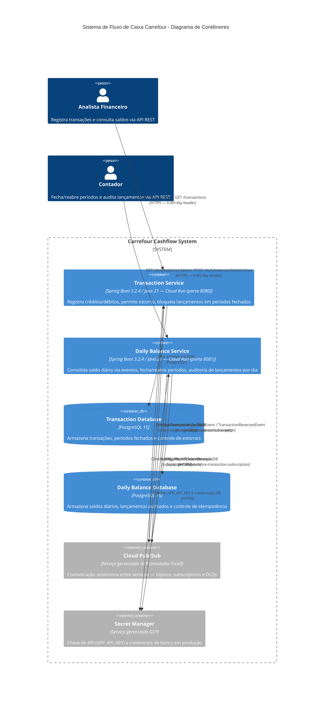

# Diagrama de Contêineres (C4 - Nível 2)

## Visão Geral dos Contêineres

O diagrama de contêineres expande a visão do sistema Carrefour Cashflow, mostrando sua decomposição em microsserviços, bancos de dados e serviços de mensageria. O acesso aos serviços é feito diretamente via API REST autenticada por API Key — sem frontend ou API Gateway implementados nesta versão.



---

## Contêineres do Sistema

### Microsserviços

**Transaction Service**
- **Tecnologia**: Spring Boot 3.2.4 / Java 21
- **Hospedagem**: Google Cloud Run (local: porta 8080)
- **Context Path**: `/transaction-service`
- **Autenticação**: API Key via header `X-API-Key` (`OncePerRequestFilter`)
- **Responsabilidades**:
  - Registro de créditos e débitos com validação de regras de negócio
  - Estorno de transações (gera registro compensatório)
  - Bloqueio de lançamentos em datas com período fechado (`closed_periods`)
  - Publicação de eventos de transação no tópico `transaction-events`
  - Consumo de eventos de período do tópico `period-events`

**Daily Balance Service**
- **Tecnologia**: Spring Boot 3.2.4 / Java 21
- **Hospedagem**: Google Cloud Run (local: porta 8081)
- **Context Path**: `/dailybalance-service`
- **Autenticação**: API Key via header `X-API-Key` (`OncePerRequestFilter`)
- **Responsabilidades**:
  - Consolidação de saldo diário via consumo de eventos
  - Fechamento (`CLOSED`) e reabertura (`OPEN`) de períodos contábeis
  - Auditoria de lançamentos por data (`GET /{date}/transactions`)
  - Garantia de idempotência via tabela `processed_events`
  - Publicação de eventos de período no tópico `period-events`

### Bancos de Dados

**Transaction Database** (`transaction-db`, porta 5432)
- **Tecnologia**: PostgreSQL 15
- **Tabelas**:
  - `transactions` — lançamentos financeiros (crédito/débito/estorno)
  - `closed_periods` — datas cujo período foi fechado (populada via evento `period-closed`)

**Daily Balance Database** (`dailybalance-db`, porta 5433)
- **Tecnologia**: PostgreSQL 15
- **Tabelas**:
  - `daily_balances` — saldos consolidados por data
  - `daily_balance_transactions` — lançamentos auditados por data (endpoint `GET /{date}/transactions`)
  - `processed_events` — controle de idempotência (eventIds já processados)

### Mensageria

**Cloud Pub/Sub** (emulador local na porta 8085)

| Tópico | Subscription | DLQ | maxDeliveryAttempts |
|---|---|---|---|
| `transaction-events` | `dailybalance-transaction-subscription` | `transaction-events-dlq` | 5 |
| `period-events` | `transaction-period-subscription` | `period-events-dlq` | 5 |

- Tópicos e subscriptions são criados automaticamente pelo container `pubsub-setup` no startup
- Mensagens não processadas após 5 tentativas são encaminhadas para a DLQ correspondente
- Ambos os serviços monitoram suas respectivas DLQs e registram alertas em log

### Infraestrutura de Segurança

**Secret Manager** (produção)
- `APP_API_KEY` — chave de autenticação das APIs
- Credenciais de banco de dados (usuário, senha, URL)
- Em ambiente local, esses valores são definidos via variáveis de ambiente no `docker-compose.yml`

---

## Fluxos Principais

**Registro de Transação:**
```
Cliente → POST /transaction-service/api/transactions (X-API-Key)
       → Transaction Service → transaction-db (INSERT)
       → Transaction Service → Pub/Sub (topic: transaction-events)
       → Daily Balance Service consome evento → dailybalance-db (UPDATE saldo)
```

**Fechamento de Período:**
```
Cliente → POST /dailybalance-service/api/dailybalances/{date}/close (X-API-Key)
       → Daily Balance Service → dailybalance-db (status = CLOSED)
       → Daily Balance Service → Pub/Sub (topic: period-events, type: period-closed)
       → Transaction Service consome evento → transaction-db (INSERT closed_periods)
       → A partir daqui: POST /transactions para {date} retorna HTTP 422
```

**Reabertura de Período:**
```
Cliente → POST /dailybalance-service/api/dailybalances/{date}/reopen (X-API-Key)
       → Daily Balance Service → dailybalance-db (status = OPEN)
       [NOTA: evento period-reopened ainda NÃO é publicado — ver roadmap]
       → closed_periods no Transaction Service NÃO é removido automaticamente
```

**Auditoria de Lançamentos por Data:**
```
Cliente → GET /dailybalance-service/api/dailybalances/{date}/transactions (X-API-Key)
       → Daily Balance Service → daily_balance_transactions (SELECT WHERE date)
       → Retorna lista de lançamentos consolidados naquele dia
```

---

## Considerações Técnicas

### Segurança
- Todos os endpoints `/api/**` exigem `X-API-Key` válida — implementado como `OncePerRequestFilter`
- Endpoints públicos (sem autenticação): `/actuator/**`, `/swagger-ui/**`, `/v3/api-docs/**`
- `shouldNotFilter()` usa `contains()` (não `startsWith()`) para acomodar o context-path no URI completo
- Em produção, a chave é lida do Secret Manager via variável de ambiente `APP_API_KEY`

### Resiliência
- Resilience4j Circuit Breaker e Retry configurados em ambos os serviços
- Idempotência no consumer do Daily Balance Service via tabela `processed_events` (eventId único)
- DLQ para mensagens não processadas após 5 tentativas (`maxDeliveryAttempts: 5`)

### Observabilidade
- Logs estruturados com Logback: `[appName, traceId, spanId, domainId]`
- Micrometer Tracing + Brave: `traceId`/`spanId` populados automaticamente em cada requisição HTTP e mensagem Pub/Sub
- Health e métricas via Spring Boot Actuator (`/actuator/health`, `/actuator/metrics`)
- Swagger UI disponível em runtime: `/{service}/swagger-ui.html`

### Escalabilidade
- Cloud Run escala automaticamente com base na demanda (0 a N instâncias)
- Comunicação assíncrona via Pub/Sub desacopla os serviços e absorve picos

