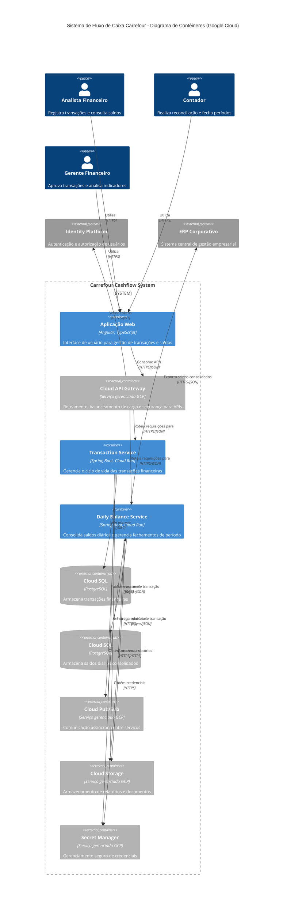

# Diagrama de Contêineres (C4 - Nível 2)

## Visão Geral dos Contêineres

O diagrama de contêineres expande a visão do sistema Carrefour Cashflow, mostrando sua decomposição em aplicações, armazenamentos de dados e serviços de alto nível na Google Cloud Platform. Este nível de detalhe revela as escolhas tecnológicas principais e como os diferentes contêineres se comunicam entre si.



---

## Contêineres do Sistema

### Interfaces de Usuário

**Aplicação Web (Frontend)**
- **Tecnologia**: Angular com TypeScript
- **Hospedagem**: Firebase Hosting
- **Descrição**: Interface de usuário unificada que permite aos usuários acessar todas as funcionalidades do sistema
- **Responsabilidades**:
  - Apresentação de dados e formulários
  - Validação inicial de entrada
  - Dashboards interativos e relatórios

### APIs e Gerenciamento

**Cloud API Gateway**
- **Tecnologia**: Google Cloud API Gateway
- **Descrição**: Serviço gerenciado para exposição, controle e proteção de APIs
- **Responsabilidades**:
  - Roteamento de requisições para os serviços apropriados
  - Controle de acesso e validação de autenticação
  - Rate limiting e proteção contra abusos
  - Versionamento de APIs

### Microsserviços

**Transaction Service**
- **Tecnologia**: Spring Boot com Java 21
- **Hospedagem**: Google Cloud Run
- **Descrição**: Serviço responsável pelo gerenciamento de transações financeiras
- **Responsabilidades**:
  - Criação e consulta de transações
  - Validação de regras de negócio para transações
  - Estorno de transações
  - Publicação de eventos de transações

**Daily Balance Service**
- **Tecnologia**: Spring Boot com Java 21
- **Hospedagem**: Google Cloud Run
- **Descrição**: Serviço responsável pela consolidação de saldos diários
- **Responsabilidades**:
  - Cálculo e atualização de saldos diários
  - Fechamento e reabertura de períodos contábeis
  - Consulta de saldos históricos
  - Processamento de eventos de transações

### Armazenamento de Dados

**Transaction Database**
- **Tecnologia**: Cloud SQL (PostgreSQL)
- **Descrição**: Banco de dados relacional gerenciado para armazenamento de transações
- **Dados armazenados**:
  - Registros de transações financeiras
  - Histórico de estornos
  - Metadados de auditoria

**Daily Balance Database**
- **Tecnologia**: Cloud SQL (PostgreSQL)
- **Descrição**: Banco de dados relacional gerenciado para armazenamento de saldos diários
- **Dados armazenados**:
  - Registros de saldos diários
  - Histórico de fechamentos de período
  - Registros de reabertura de períodos

### Serviços de Infraestrutura

**Cloud Pub/Sub**
- **Tecnologia**: Google Cloud Pub/Sub
- **Descrição**: Serviço de mensageria gerenciado para comunicação assíncrona
- **Responsabilidades**:
  - Transporte de eventos entre serviços
  - Garantia de entrega de mensagens
  - Desacoplamento de serviços

**Cloud Storage**
- **Tecnologia**: Google Cloud Storage
- **Descrição**: Armazenamento de objetos para arquivos e documentos
- **Responsabilidades**:
  - Armazenamento de relatórios gerados
  - Exportações para consumo externo
  - Backups de dados processados

**Secret Manager**
- **Tecnologia**: Google Cloud Secret Manager
- **Descrição**: Serviço para gerenciamento seguro de credenciais
- **Responsabilidades**:
  - Armazenamento seguro de credenciais de banco de dados
  - Chaves de API para serviços externos
  - Tokens e segredos da aplicação

### Autenticação e Autorização

**Identity Platform**
- **Tecnologia**: Google Cloud Identity Platform
- **Descrição**: Serviço de gerenciamento de identidade e acesso
- **Responsabilidades**:
  - Autenticação de usuários
  - Gestão de perfis e permissões
  - Single Sign-On (SSO)

---

## Interações entre Contêineres

### Fluxos Principais

**Registro de Transação:**
```
Analista Financeiro → Web App → API Gateway → Transaction Service → Cloud SQL
                                              Transaction Service → Pub/Sub → Daily Balance Service
```

**Consulta de Saldo:**
```
Contador → Web App → API Gateway → Daily Balance Service → Cloud SQL
```

**Fechamento de Período:**
```
Contador → Web App → API Gateway → Daily Balance Service → Cloud SQL
                                   Daily Balance Service → ERP Corporativo
                                   Daily Balance Service → Cloud Storage (relatórios)
```

**Aprovação de Transação de Alto Valor:**
```
Gerente Financeiro → Web App → API Gateway → Transaction Service → Cloud SQL
                                             Transaction Service → Pub/Sub → Daily Balance Service
```

### Padrões de Comunicação

- **Comunicação Síncrona**: APIs REST são usadas para comunicações que requerem resposta imediata (consultas, operações CRUD)
- **Comunicação Assíncrona**: O Cloud Pub/Sub é utilizado para eventos que podem ser processados de forma assíncrona

---

## Considerações Técnicas

### Escalabilidade
- Cloud Run permite escala automática de 0 a N instâncias com base na demanda
- Cloud SQL pode ser configurado para auto-escalar verticalmente
- API Gateway gerencia picos de tráfego eficientemente

### Resiliência
- Serviços em Cloud Run são stateless e distribuídos por múltiplas zonas
- Cloud Pub/Sub garante entrega de mensagens mesmo com falhas temporárias
- Cloud SQL oferece replicação e backups automáticos

### Segurança
- Identity Platform centraliza a autenticação e autorização
- Secret Manager gerencia credenciais de forma segura
- Comunicação entre serviços é protegida por TLS
- VPC Service Controls pode isolar recursos em rede privada

---

## Evolução Futura

Este diagrama de contêineres representa a versão atual do sistema. Futuras expansões podem incluir:

- **Notification Service**: Para gerenciamento de notificações e alertas
- **Reporting Service**: Para geração de relatórios complexos e análises avançadas
- **BigQuery Integration**: Para análises de dados e inteligência de negócios em grande escala
