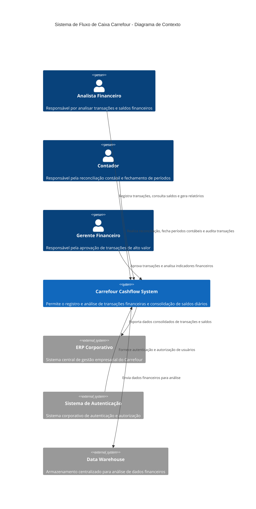

# Diagrama de Contexto (C4 - Nível 1)

## Visão Geral do Sistema

O diagrama de contexto mostra o Carrefour Cashflow System como um único sistema de software e suas interações com usuários e sistemas externos. Este diagrama representa a visão de mais alto nível do sistema, concentrando-se no "o quê" em vez do "como".

---

## Elementos do Sistema

### Atores (Pessoas)

**Analista Financeiro**
- **Responsabilidade**: Registrar transações financeiras diárias, consultar saldos e gerar relatórios operacionais
- **Interações**: Acessa o sistema para entrada de dados, consultas e análises de curto prazo

**Contador**
- **Responsabilidade**: Realizar reconciliação financeira, fechar períodos contábeis e auditar transações
- **Interações**: Utiliza o sistema para verificar consistência entre registros contábeis e financeiros

**Gerente Financeiro**
- **Responsabilidade**: Aprovar transações de alto valor, analisar indicadores financeiros e tomar decisões estratégicas
- **Interações**: Acessa painéis gerenciais e fluxos de aprovação no sistema

### Sistemas Internos

**Carrefour Cashflow System**
- **Objetivo**: Sistema central para gestão de fluxo de caixa do Carrefour Bank
- **Funcionalidades**: Registro de transações, consolidação de saldos diários, geração de relatórios, estorno de transações, fechamento de períodos

### Sistemas Externos

> **Nota:** Os sistemas externos listados abaixo representam integrações **planejadas** (roadmap). Nenhuma delas está implementada na versão atual. A autenticação atual usa API Key direta (`X-API-Key`), sem integração com sistema de autenticação corporativo.

**ERP Corporativo**
- **Relação**: Sistema central do Carrefour que poderia receber dados consolidados do Cashflow
- **Interação**: Integração futura para consolidação financeira global — atualmente não conectada

**Sistema de Autenticação**
- **Relação**: Provedor de identidade corporativa do Carrefour
- **Interação**: Integração futura para SSO corporativo — atualmente a autenticação é via API Key

**Data Warehouse**
- **Relação**: Repositório central de dados para análise financeira
- **Interação**: Integração futura para BI e reporting estratégico — atualmente não conectada

---

## Descrição das Interações

### Interações com Usuários

**Analista Financeiro → Cashflow System**
- Registra transações financeiras (créditos e débitos)
- Consulta saldos diários e transações históricas
- Gera relatórios operacionais de fluxo de caixa
- Executa estornos de transações quando necessário

**Contador → Cashflow System**
- Realiza conciliação entre registros contábeis e financeiros
- Fecha períodos diários e mensais, garantindo consistência
- Audita transações financeiras e saldos
- Gera relatórios contábeis e fiscais

**Gerente Financeiro → Cashflow System**
- Aprova transações que excedem limites operacionais
- Analisa indicadores financeiros através de dashboards
- Monitora tendências de fluxo de caixa para decisões estratégicas

### Interações com Sistemas Externos (planejadas)

> As interações abaixo são **integrações futuras** mapeadas no roadmap. O sistema atual opera de forma independente, sem dependência de sistemas corporativos externos.

**Cashflow System → ERP Corporativo** *(não implementado)*
- Envio periódico de dados consolidados para reconciliação financeira global

**Cashflow System → Data Warehouse** *(não implementado)*
- Exportação de dados transacionais para BI e reporting estratégico

**Sistema de Autenticação → Cashflow System** *(não implementado)*
- Autenticação via SSO corporativo — atualmente substituída por API Key

---

## Considerações de Segurança e Compliance

- O sistema opera em ambiente regulado pelo Banco Central, seguindo normas bancárias
- Todas as transações são imutáveis e auditáveis
- Acesso restrito com base em funções e responsabilidades
- Registros de auditoria são mantidos para todas as operações críticas

---

## Limites do Sistema

Este diagrama de contexto representa uma visão simplificada do ecossistema. Outras integrações menores com sistemas satélites, como ferramentas de gestão de risco e compliance, não estão representadas para manter a clareza da visão geral.
